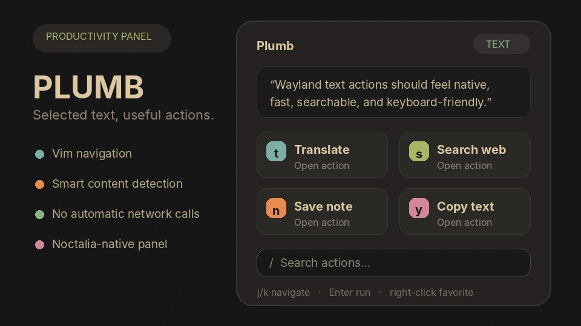

# Plumb

Plumb snapshots the current Wayland primary selection and opens a searchable, mouse-friendly action panel. It is designed for both quick pointer use and Vim-style keyboard navigation.



## Plugin

| Field | Value |
|---|---|
| ID | `harunnoir/plumb` |
| Entries | Panel: `actions` |

## Requirements

Install the dependencies declared by the plugin:

- `wl-clipboard` — provides `wl-paste`, used to capture the Wayland primary selection.
- `xdg-utils` — provides `xdg-open`, used to open files and web URLs. Plumb can fall back to `gio` when available.

On Void Linux:

```bash
sudo xbps-install -S wl-clipboard xdg-utils
```

The optional **Edit in terminal** action also needs the editor configured in Plumb's settings, such as `nvim` or `hx`.

## Usage

Select text in any Wayland application, then open the panel:

```bash
noctalia msg panel-toggle harunnoir/plumb:actions
```

A Niri keyboard binding:

```kdl
Mod+P repeat=false {
    spawn "noctalia" "msg" "panel-toggle" "harunnoir/plumb:actions";
}
```

A Niri mouse binding:

```kdl
Mod+MouseRight repeat=false {
    spawn "noctalia" "msg" "panel-toggle" "harunnoir/plumb:actions";
}
```

Plumb detects ordinary text, URLs, email addresses, existing file paths, code, and common error output. The available actions change to match the detected content.

### Main actions

- Translate through Google Translate or DeepL.
- Search through DuckDuckGo, Google, Brave, Startpage, Wikipedia, GitHub, Stack Overflow, YouTube, or Reddit.
- Save a quick note, Markdown quote, code snippet, or daily note.
- Copy, edit, open, or repeat the previous action.
- Filter large action lists using the search field pinned to the bottom.
- Right-click an action to favorite or unfavorite it.

### Vim navigation

| Key | Action |
|---|---|
| `j`, `Ctrl+n` | Select the next action |
| `k`, `Ctrl+p` | Select the previous action |
| `Ctrl+d`, `Ctrl+u` | Move down or up five actions |
| `g`, `G` | Jump to the first or last action |
| `l`, `Enter` | Execute the selected action |
| `1`–`9` | Execute the numbered action |
| `/` | Focus action filtering |
| `Ctrl+g` | Clear filtering and return to navigation |
| `h` | Go back; from the main page, close |
| `q` | Close |
| `?` | Show keyboard help |
| `.` | Repeat the previous action |
| `t`, `s`, `n`, `y`, `e` | Translate, search, note, copy, or edit |
| `Escape` | Close the panel; Noctalia reserves this key |

## Settings

| Setting | Type | Default | Description |
|---|---|---|---|
| `notes_file` | `file` | `~/.local/share/plumb/notes.md` | File used by quick note, quote, and snippet actions. |
| `daily_notes_dir` | `folder` | `~/.local/share/plumb/daily` | Directory containing `YYYY-MM-DD.md` daily notes. |
| `editor` | `string` | `nvim` | Terminal editor command used for file editing. |
| `close_after_action` | `bool` | `true` | Close the panel after completing an action. |
| `default_search` | `select` | `duckduckgo` | Search engine used by the `s` shortcut. |
| `default_translate_target` | `select` | `ar` | Target language used by the `t` shortcut. |

## Notes

### Privacy and network behavior

Opening Plumb reads the local primary selection using `wl-paste --primary --no-newline`. When that selection is empty, it falls back to Noctalia's clipboard text.

Plumb does not make an automatic network request. Choosing an online search or translation action opens a URL containing the selected text in the default browser. This sends the query to the chosen provider only after explicit activation.

### Filesystem writes

Plumb writes only when the user explicitly saves a note or updates plugin preferences/history:

- Quick notes and daily notes use the configured paths above.
- Favorites and the last action are stored in Noctalia's per-plugin data directory.

### Spawned processes

Depending on the selected action, Plumb may start:

- `wl-paste` to capture the selection.
- `xdg-open` or `gio open` to open a URI or file.
- The configured terminal editor for an existing file.

All plugin code is readable Luau and does not download or execute remote code.
